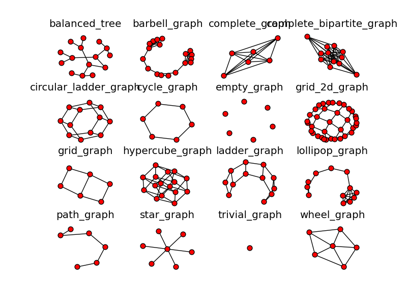
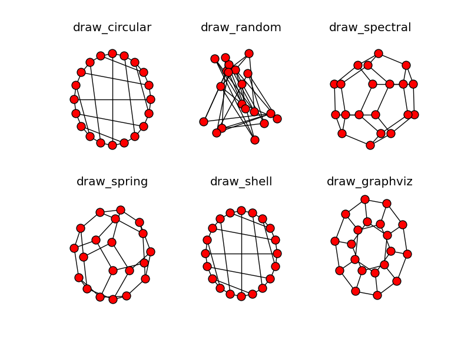
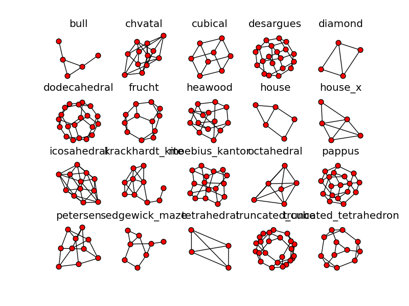
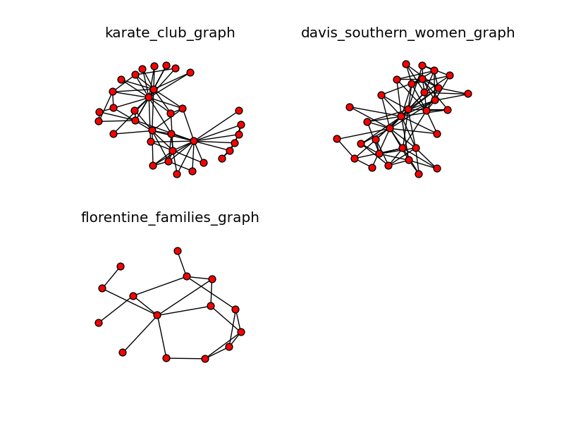
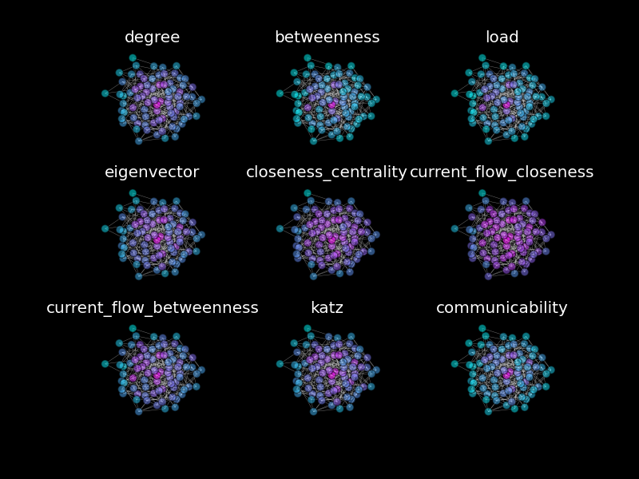
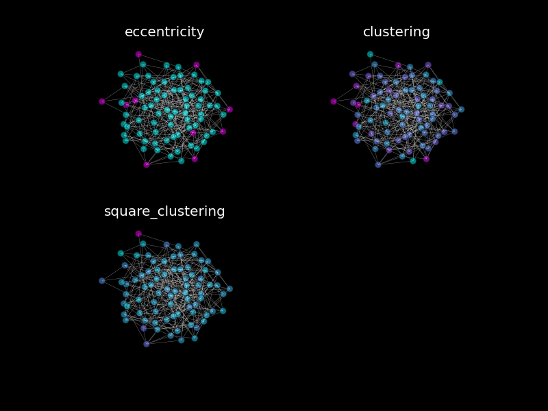
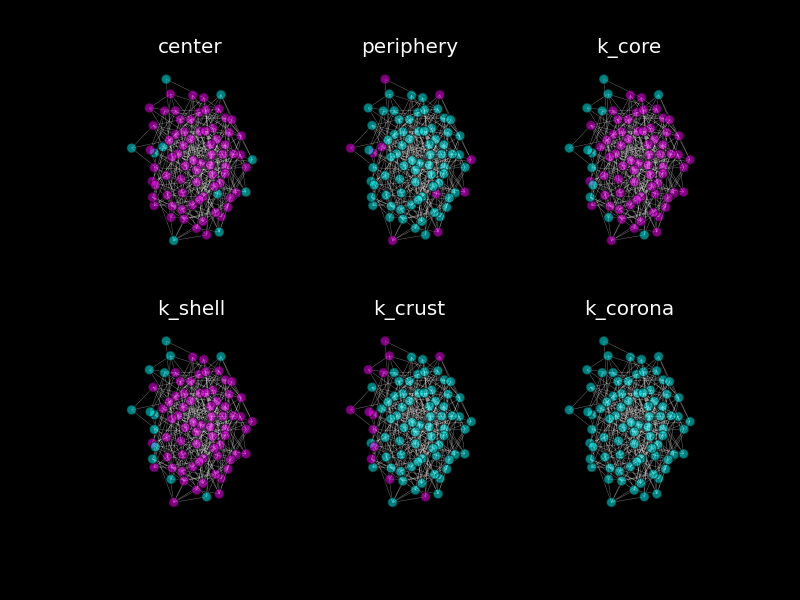

# Networkx Examples
Playing around with networkx

# Examples of Graphs
--------------------

## Classic Graphs

These graphs are what matplotlib considers "classical".

## Layouts

A Dodecahedral Graph under various layouts.
1. `circular` and `shell` appear to be similar.
2. `graphviz` appears to be highly strucutred
3. spetral` and `spring` give similar "nice" fits.

## Small Graphs

A collection of small graphs

## Social Graphs

The classic social graphs

# Properties of graphs
----------------------

## Centrality

Different notions of graph centrality for the same graph.
1. Some measures are more generous with their definition of centrality.
2. Most measures exhibit a high correlation.

## Distance

The notion of distance in a graph

## Sets

Bi-coloring of different sets based on certain criteria.
